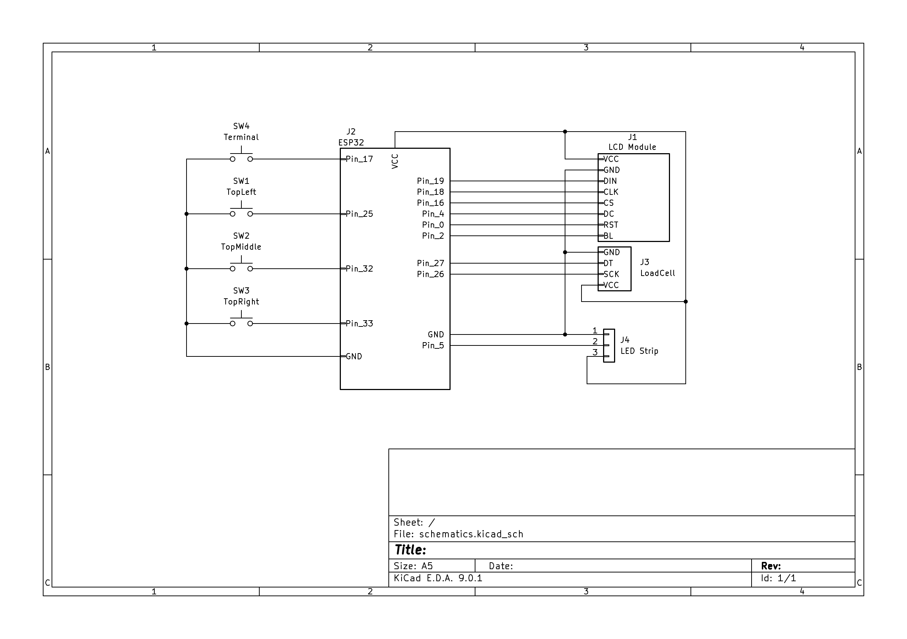
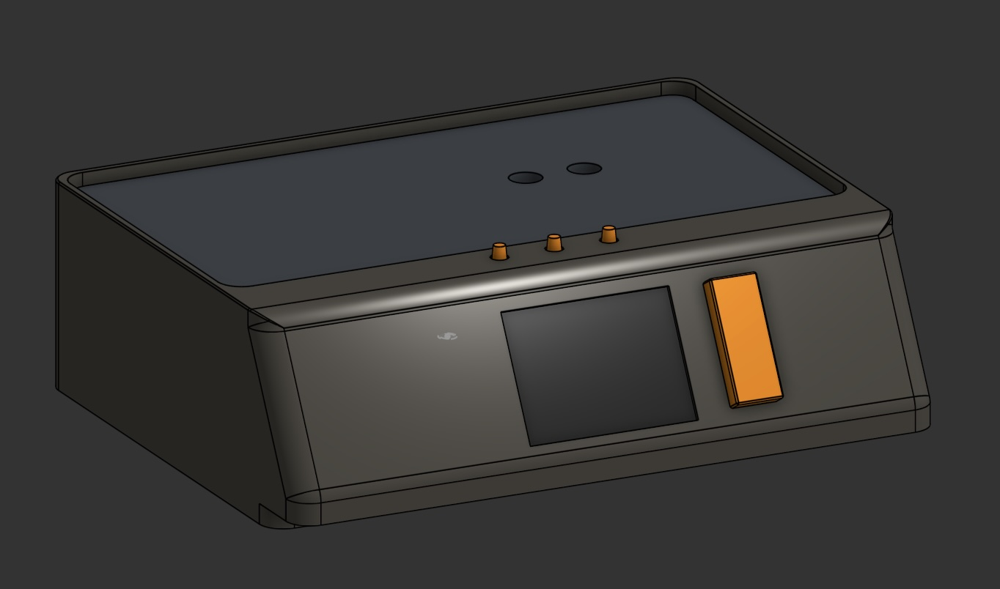

# terminal.scale

> [!NOTE]
> This project is not affiliated with terminal.shop. It's an entry for their API contest.

Don't you miss the good old days of [Amazon Dash](https://en.wikipedia.org/wiki/Amazon_Dash)? What if we could bring it back, but like... better?
This AI™✝︎ powered coffee _bag_ scale offers the perfect solution for lazy, single dosing, people who want someone else to tell them when to buy new coffee - or even let the scale do it for them.
While it can be used to weigh anything, the scale is connected to the [terminal.shop](https://terminal.shop) API to keep your life simple. Go and focus on the important things in life, like drinking coffee, and let the scale do the rest.

✝︎: that's a lie. All you need is a load cell, seriously. But anything with AI in its name is better, right?

## Meet the scale


> [!NOTE]
> Why not `cron`? Good question. Trust issues. Why trust terminal to send me coffee on a schedule when I can have trust issues with my own code?

## Features

- Weigh your coffee bag (it's actually pretty accurate!)
- Use it as a normal scale and in "Barista Mode" (see below)
- Browse and buy coffee from [terminal.shop](https://terminal.shop)
- View order history
- Get notified when you are running out of coffee, reorder automatically (if you want to)
- Includes a 2" LCD display, four buttons to interact with the scale, and a led strip for additional visual feedback
- User-guided setup process

## Usage

### Continuous Weighing


The scale is configured to take a measurement every second. It detects if a bag is removed from the surface (for example when you are taking it off so that you can get the beans you need). If the bag is placed on the scale and the weight falls below 150g (configurable in [`src/scale.h`](src/scale.h)), the scale will start showing an `Order` button on the top right menu. Pressing this button will take you to the terminal.shop website where you can reorder the bag.
Once the weight falls below 100g, you will be prompted whether you would like to reorder the same bag. Dismissing the prompt will mute it until you switch menus, restart the scale, or the weight goes back above 100g.
During the configuration, you can decide whether you want the scale to automatically reorder the bag when it falls below 100g. If you choose this option, the following logic applies:

- Show messaging with a countdown (60 seconds)
- Pressing any button during the countdown will cancel the order
- If the countdown reaches 0, the order will be placed automatically
- When an order was placed or the reordering process was cancelled, no new order will be placed until a new bag has been loaded

|                                                                                                                       |                                                                                                                        |
| --------------------------------------------------------------------------------------------------------------------- | ---------------------------------------------------------------------------------------------------------------------- |
|  |  |

### Loading Bags

1. Press the `Load Bag` button on the top left
1. Select the bag you want to load, follow on-screen instructions

### Barista Mode

|                                                                                                                            |                                                                                                                                  |                                                                                                                            |
| -------------------------------------------------------------------------------------------------------------------------- | -------------------------------------------------------------------------------------------------------------------------------- | -------------------------------------------------------------------------------------------------------------------------- |
|  |  |  |

You can turn Barista Mode on from the main menu. This will disable the tracking of your coffee bag weight and allow you to instead measure your coffee beans. When turning this mode on, the scale will tare automatically (I recommend taking the bag off, then turning barista mode on). You can also manually tare it by pressing the `Tare` menu button.
The scale allows you to switch between `single` and `double` dosing through the menu. The values for the doses are configurable in [`src/scale.h`](src/scale.h). You will see visual indications on the display and LED strip as you get closer to the target weight. A green light and UI is shown when you are less than 0.5g away from the target weight. Once
over the target weight, the UI will turn red.

### Store

You can open the store from the main menu by pressing the orange `Terminal` button to the right of the screen. This will take you to the landing page of the store. From there, you can view your order history or browse the store's products.

#### Order History


You can scroll through your order history and see the order ID, the date you ordered, and if available the delivery status.

#### Browsing the Store

|                                                                                                                    |                                                                                                                                |
| ------------------------------------------------------------------------------------------------------------------ | ------------------------------------------------------------------------------------------------------------------------------ |
|  |  |

You can scroll through the currently available products. Currently, only `12oz` variants are displayed. You can order your coffee by pressing and holding the `Terminal` button for a few seconds (just follow the on-screen instructions).

## Parts

> [!NOTE]
> This is a list of _parts that I used_, you won't need the exact same ones if you are weird enough to build one yourself. Links are not affiliate links.

| Part                                                                                                   | Link                                                                         |
| ------------------------------------------------------------------------------------------------------ | ---------------------------------------------------------------------------- |
| `ESP32 NodeMCU Module WLAN WiFi Development Board \| Dev Kit C V2 with CP2102 compatible with Arduino` | [AZ-Delivery](https://www.az-delivery.de/en/products/esp32-developmentboard) |
| 1kg Load Cell with HX711 module                                                                        | [Amazon](https://amzn.eu/d/5iR4k10)                                          |
| 2inch LCD Display Module, IPS Screen, 240×320 Resolution, SPI Interface                                | [Waveshare](https://www.waveshare.com/2inch-lcd-module.htm)                  |
| WS2812 LED Strip (8 LEDs needed)                                                                       | [Amazon](https://amzn.eu/d/2FZAlWC)                                          |
| PCB Buttons✝︎                                                                                          | [Amazon](https://amzn.eu/d/ifVMcsS)                                          |
| USB C connector✝︎✝︎                                                                                    | [Amazon](https://amzn.eu/d/873gVnI)                                          |
| 2x M4x10mm screws                                                                                      | -                                                                            |
| 1x M5x16mm screw                                                                                       | -                                                                            |
| Rubber feet                                                                                            | [Amazon](https://amzn.eu/d/9uYd7lF)                                          |

Total cost: ~30€ (if you already have an LED strip or can buy a shorter one)

Additionally, the following tools will be needed:

- Soldering iron
- Hot glue gun
- 3D Printer (or a friend with one)
- Some (preferrably electric) tape

I used the following 3D printer materials:

- [Bambu Lab PLA Metal (Iron Gray Metallic)](https://eu.store.bambulab.com/collections/pla/products/pla-metal?variant=46797850902876) for the scale body
- [Bambu Lab PLA Basic (Blue Gray)](https://eu.store.bambulab.com/collections/pla/products/pla-basic-filament?variant=42911328075995) for the weighing surface
- [Bambu Lab PLA Basic (Orange)](https://eu.store.bambulab.com/collections/pla/products/pla-basic-filament?variant=42911327879387) for the buttons

✝︎: I used two different heights of buttons (the orange terminal button sticks out a bit more than the others), but having all the same height is probably better. I wouldn't use these buttons again (I just had them around) since they really are meant for PCBs, so mounting them was hard-ish (read more below).
✝︎✝︎: I linked a two-wire USB C connector, but you should probably use one that works with power delivery negotation. If you don't you will need something like a USB A to USB C adapter to power the scale.

## Schematic

> [!NOTE]
> I haven't drawn a schematic in 10 years so this will be all kinds of wrong, but should give you a good enough idea of how to wire everything up. Use a breadboard to test everything before soldering it. I drew this similarly to how I actually used the different pins of the ESP32 (since there are multiple GND pins available, for example). All the switches were soldered to a little PCB that distributed GND, as well as VCC/GND to the Load Cell and LED Strip.



## 3D Model



The 3D model is available on [MakerWorld](!TODO). It was modeled with onshape and the source file is available [here](https://cad.onshape.com/documents/3b384bc84e744622a2db15e2/w/2cd6301093df21519d2cb877/e/4a26cedb8ca3c7d20522d794?renderMode=0&uiState=68025464e3edd00b6c11fb3d).

## Background

The most important part of this project is the load cell. They are surprisingly cheap and accurate once calibrated. For this project, a 1kg load cell made the most sense since I don't expect bags heaver than 1kg to be put on the scale (also more or less enforced by the size of the scale and the brim around the weighing area). The load cell is connected to the ESP32 via an HX711 amplifier.
The scale is configured to always refer back to its zero offset rather than taring on startup because it is expected to be (re)started with a bag placed on it. This way, the scale will always show the weight of whatever is on it.

For better scale accuracy, it would also be beneficial to have a weighing surface that is not 3d printed (or uses a stronger material) because the 3D printed surface does not have much strength, causing bending and different readings depending on the weight distribution.

The contents of the bag are guesstimated: I weighed an empty bag and the scale will remove this weight from readings. You might need to adjust this based on the bag you are using - in Germany we only have `flow` available as of right now, so I am not sure if other products have different weights.

If you want to save on some cost, the LED strip is the least useful thing in this project. It provides additional visual feedback (when scrolling through menus, being notified of an empty bag, etc.) but not having it won't hurt you.

## Assembly

> [!WARNING]
> The scale is built to support 12oz bags only at the moment. You will probably have to change the model and code to make other bags fit.

1. Print all 3D parts
1. Install four rubber feet on the bottom of the scale
1. Place the LED Strip through the whole on the bottom of the scale - the connecting cables need to face through the hole
1. Solder wires to the button for the terminal button and hot glue it in place
1. Fit the display into the case and tape it in place (can be hot glued later once you are sure everything works)

   

1. Solder wires to the top menu buttons and hot glue them in place
1. Screw the load cell into the case of the scale through the bottom hole using an M5 screw (make sure the load cell is oriented correctly!)

   

1. Connect all the wires as shown in the schematic (no promises that I didn't mess it up)

   

1. Install the USB C connector and connect it to the ESP32
   - If you are using a 2-wire connector, connect a data-capable USB cable to the ESP32 until you have calibrated the scale
1. Tape loose wires to the bottom of the scale so that they do not push up on the weighing surface (doesn't need to be pretty or perfect, as evidenced by the following picture)

   

1. Install the weighing surface and fix it in place with the M4 screws
   - Make sure that the weighing surface is not touching the walls or anything else is pushing on it
1. Install the terminal button and top menu button caps by squeezing it on the PCB button (you might need to re-print with a different scale or glue it in place)

### Software

To compile the code, you will need to use [`PlatformIO`](https://platformio.org/). I personally used the VSCode extension (I use neovim btw, but there is no good support for PlatformIO or Arduino).

1. Create a personal access token on [terminal.shop](https://terminal.shop) and copy it to your clipboard
1. Create a `include/wifi.secret.h` and fill it with the following content:

   ```cpp
   #ifndef WIFI_SECRET_H
   #define WIFI_SECRET_H

   #define WIFI_SSID "your_wifi_ssid"
   #define WIFI_PASSWORD "your_wifi_password"
   #define TERMINAL_API_URL "https://api.terminal.shop"
   #define TERMINAL_PAT "trm_your_personal_access_token"

   #endif
   ```

   > [!NOTE]
   > The scale will always use the first card and shipping address that is configured in your terminal account. If you want to change this, you will need to change the code.

1. Build and upload the code to the ESP32

### Calibration

On first startup, you will be automatically put into calibration mode. Attach a Serial listener to the USB port and follow the instructions. Please note that the calibration weight needs to be input as _milligrams_ instead of grams. Once calibrated, you will no longer need any connection to the ESP32.

#### Re-calibration

If you need to re-calibrate the scale, connect an USB cable to the ESP32. Make sure `SERIAL_LISTEN` is enabled in [`include/debug.h`](include/debug.h) and connect to the controller with a serial monitor. Once the scale has restarted, send `calibrate` to the scale via the serial monitor. The scale will then enter calibration mode and you can follow the instructions on the screen.
